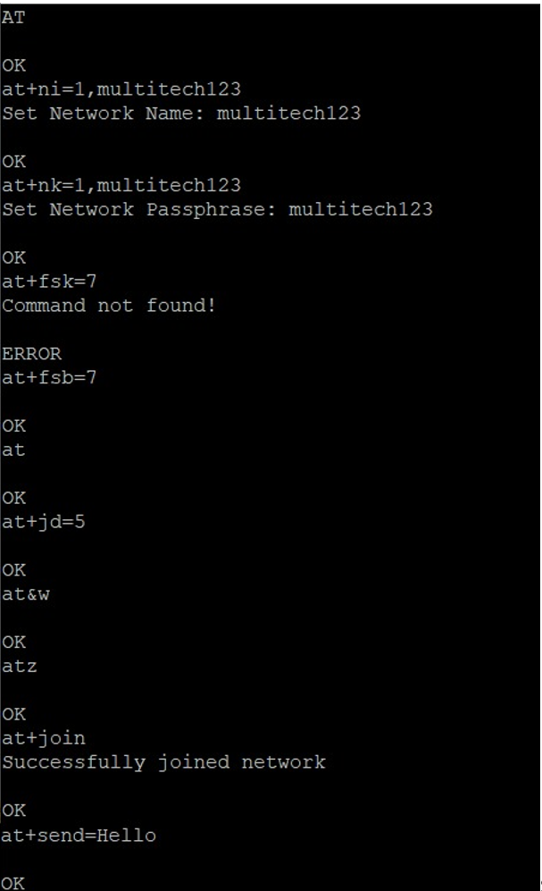
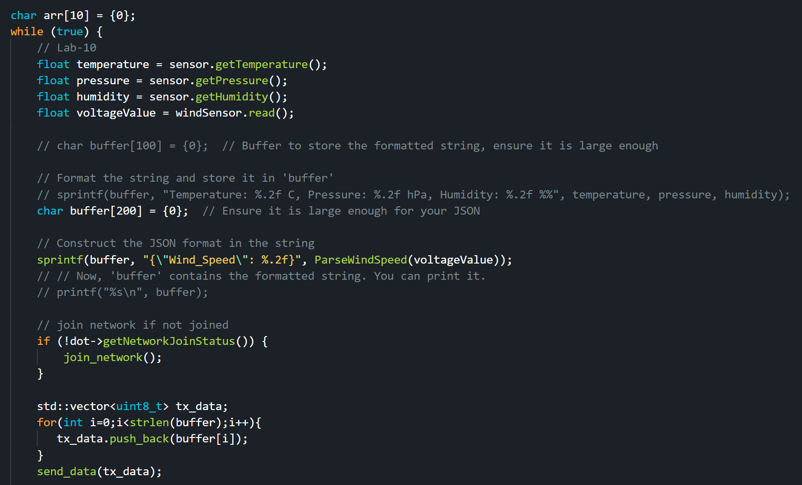

# ee542_FinalProject

### xDot Setup

In this part, the xDot will be configured to build a connection with Multi-Tech Conduit, a gateway device, for data transmission.  

- The first thing is to upload "AT command firmware" file to xDot. 

    > The AT commands are used for configuring and controlling the device, especially for communication over the LoRaWAN (Long Range Wide Area Network) protocol. 

- Then we need to program the xDot in order to send the data it collects back to conduit. 

Both firmware and programmed BIN file has been provided. All you need to do is to drag them to the driver folder of xDot.  

##### Dot-AT-Firmware

- The AT firmware bin file can be found under the folder `ee542_FinalProject/xDot_Bin_Files`.  
- Drag it to xDot driver folder. Make sure the transmission did not fail. 
- Open a serial connection to the USB UART (**not the debug port**) with a baud of 115200. The proper port name can also be found in Device Manager if you are using Windows OS. 
- Hit the reset button on the xDot. Now you are ready to configure xDot with AT command. 
- Typing `AT` command, and the xDot must return an OK which determines successful connection and a working AT firmware.
- Now configure xDot by following screenshot. This will allow xDot to comminicate with Conduit gateway. 
    

##### Dot-Examples.bin

The BIN file can be found under same folder `ee542_FinalProject/xDot_Bin_Files`.  The purpose of this BIN is to allow xDot to parse the real-time data it collects from a wind sensor, and transmit the measurements back to the gateway. 

The following image shows the coding part of the data transmission. 

